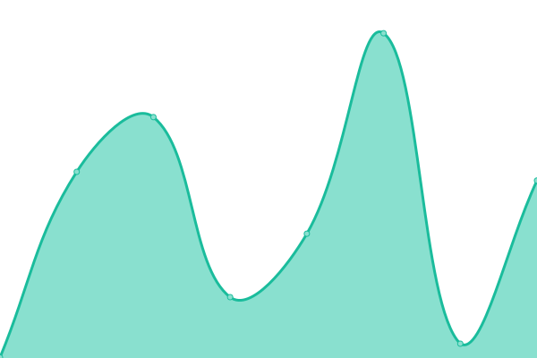
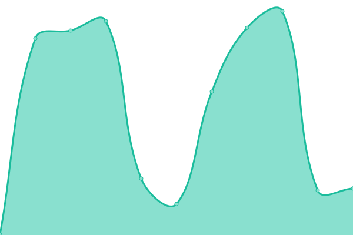

# [📈 Live Status](https://vovanduc.github.io/vinacis): <!--live status--> **🟧 Partial outage**

This repository contains the open-source uptime monitor and status page for [LeeBin](https://www.linkedin.com/in/vovanduc), powered by [Upptime](https://github.com/upptime/upptime).

With [Upptime](https://upptime.js.org), you can get your own unlimited and free uptime monitor and status page, powered entirely by a GitHub repository. We use [Issues](https://github.com/vovanduc/vinacis/issues) as incident reports, [Actions](https://github.com/vovanduc/vinacis/actions) as uptime monitors, and [Pages](https://vovanduc.github.io/vinacis) for the status page.

<!--start: status pages-->
<!-- This summary is generated by Upptime (https://github.com/upptime/upptime) -->
<!-- Do not edit this manually, your changes will be overwritten -->
<!-- prettier-ignore -->
| URL | Status | History | Response Time | Uptime |
| --- | ------ | ------- | ------------- | ------ |
|  [Vinacis](https://vinacis.com) | 🟩 Up | [vinacis.yml](https://github.com/vinacis/vinacis/commits/HEAD/history/vinacis.yml) | 

 3947ms
     
 | 

<a href="https://demo.upptime.js.org/history/vinacis">100.00%</a>
    

|  [Wikipedia](https://en.wikipedia.org) | 🟩 Up | [wikipedia.yml](https://github.com/vinacis/vinacis/commits/HEAD/history/wikipedia.yml) | 

 155ms
     
 | 

<a href="https://demo.upptime.js.org/history/wikipedia">100.00%</a>
    

|  [Hacker News](https://news.ycombinator.com) | 🟩 Up | [hacker-news.yml](https://github.com/vinacis/vinacis/commits/HEAD/history/hacker-news.yml) | 

 318ms
     
 | 

<a href="https://demo.upptime.js.org/history/hacker-news">100.00%</a>
    

|  [Broken Site](https://thissitedoesnotexist.com) | 🟥 Down | [broken-site.yml](https://github.com/vinacis/vinacis/commits/HEAD/history/broken-site.yml) | 

 0ms
     
 | 

<a href="https://demo.upptime.js.org/history/broken-site">100.00%</a>
    

|  [Test for HEAD](https://www.google.com) | 🟩 Up | [test-for-head.yml](https://github.com/vinacis/vinacis/commits/HEAD/history/test-for-head.yml) | 

 144ms
     
 | 

<a href="https://demo.upptime.js.org/history/test-for-head">100.00%</a>
    

|  Secret Site | 🟥 Down | [secret-site.yml](https://github.com/vinacis/vinacis/commits/HEAD/history/secret-site.yml) | 

 0ms
     
 | 

<a href="https://demo.upptime.js.org/history/secret-site">100.00%</a>
    

|  [TCP ping](1.1.1.1) | 🟩 Up | [tcp-ping.yml](https://github.com/vinacis/vinacis/commits/HEAD/history/tcp-ping.yml) | 

 73ms
     
 | 

<a href="https://demo.upptime.js.org/history/tcp-ping">100.00%</a>
    

<!--end: status pages-->

[**Visit our status website →**](https://vovanduc.github.io/vinacis)

## 📄 License

- Powered by: [Upptime](https://github.com/upptime/upptime)
- Code: [MIT](./LICENSE) © [LeeBin](https://www.linkedin.com/in/vovanduc)
- Data in the `./history` directory: [Open Database License](https://opendatacommons.org/licenses/odbl/1-0/)
